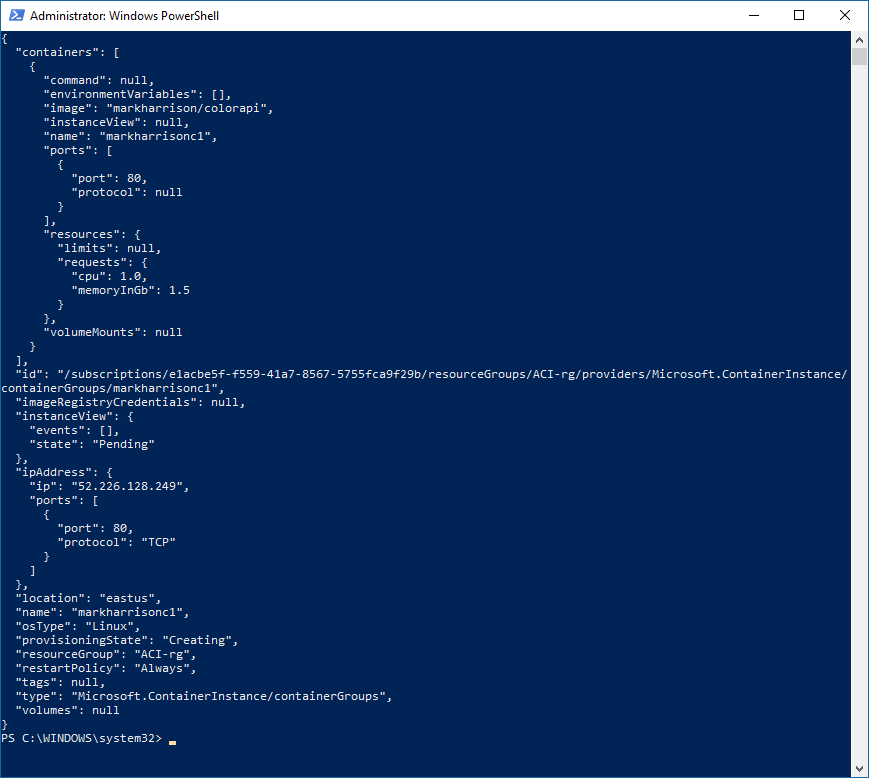
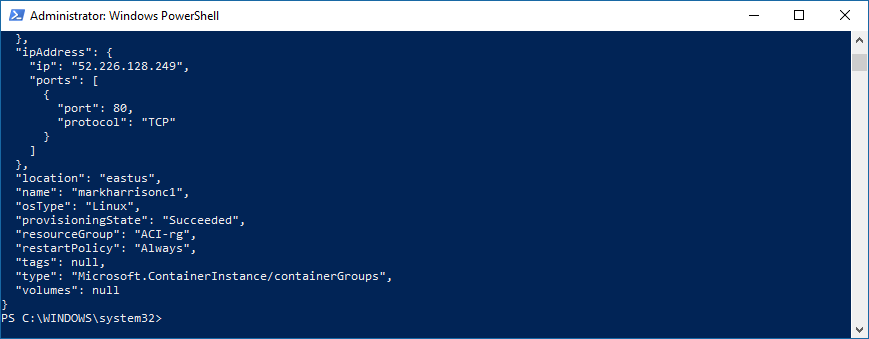
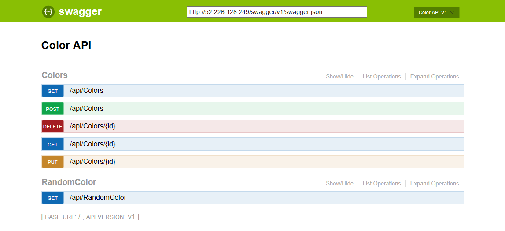
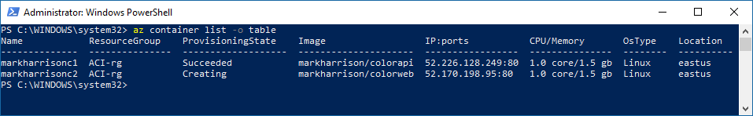
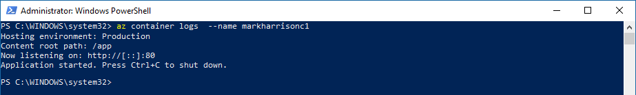

# Azure Container Instances - Hands-on Lab Script

Mark Harrison : 24 Nov 2017


## Overview

Azure Container Instances offers the fastest and simplest way to run a container in Azure, without having to provision any virtual machines and without having to adopt a higher-level service.

## Create Container Instance

All Azure resources must reside with an Azure resource group.

- Invoke the following:
  - Amend the resource group name to that required - and in the subsequent instructions
  - Amend the location to that require (check ACI is available)

```text
az group create --name ACI-rg --location eastus
az configure --defaults group=ACI-rg
```

We can create a container using the `az container create` command.  This will specify a Docker image located in a container registry such as the Docker hub or the Azure Container Registry.

- Invoke the following:
  - Amend the container name to that required - and in the subsequent instructions
  - Optionally - use your own image

```text
az container create --name markharrisonc1 --image markharrison/colorapi --ip-address public --ports 80
```



## Monitoring

We can see the provisioning state of the container using the `az container show` command.  The container will originally be in a Creating state - it will be pulling down the image from the registry. When provisioned it will be in a state of Succeeded.

- Invoke the following:
  - Amend the container name to that required

```text
az container show --name markharrisonc1
```



The output will give the IP address of the container.  We can then browse to it (append `/swagger`) e.g. <http://52.226.128.249:80/swagger>



If we have multiple container, we can see them all using the `az container list` command.

- Invoke the following:

```text
az container create --name markharrisonc2 --image markharrison/colorweb --ip-address public --ports 80

az container list -o table
```



We can examine the logs for the container using the `az container logs` command.

```text
az container logs  --name markharrisonc1
```



## Delete Container Instance

Finally tidy up - using the `az container delete` command.

- Invoke the following:

```text
az container delete --name markharrisonc1 -y
az container delete --name markharrisonc2 -y

az group delete --name ACI-rg  -y
```

---
<http://github.markharrison.io>